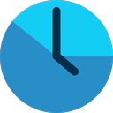

# BUILD-A-CHROME-EXTENSION-FOR-PRODUCTIVITY-MANAGEMENT

*COMPANY*: CODTECH IT SOLUTIONS

*NAME*: KUNJ BIHARI YADAV

*Intern ID*: CT04DK89

*DOMAIN*: MERN STACK WEB DEVELOPMENT

*DURATION*: 4 WEEKS

*MENTOR*: NEELA SANTHOSH

## Description of Task 4
Time Tracker & Productivity Management is a browser extension designed to help users monitor and manage the time they spend online. The extension tracks active browser usage, categorizes time spent on different websites, and provides insights into browsing habits. It also includes features like notifications for excessive time spent on specific sites, customizable idle detection, and the ability to export or import time-tracking data.

    
    <h1>Time Tracker & Productivity Management</h1>

# OUTPUT

|   |   |
|---|---|
|  |  |

## Key Features

- Time Tracking: Automatically tracks time spent on websites and displays usage statistics.
- Idle Detection: Stops tracking when the browser is idle or unfocused.
- Video Tracking: Option to continue tracking time while watching videos.
- Notifications: Alerts users when they spend too much time on a single site.
- Data Management: Export and import time-tracking data for backup or analysis.
- Customizable Settings: Adjust idle timers, notification intervals, and more.
- Cross-Browser Support: Compatible with both Chrome and Firefox.

## Steps to install

- Clone the repository.
- `npm install`  - To install dependencies
- `npm run dev`  - To build the extension inside the dist folder.
- Go to chrome://extensions and inside select the “Load unpacked” option.
- Before that make sure you toggle the "Developer mode" option.
- Upload the dist folder; ideally, you should see your extension in the list.
- In your extensions list, you should see your new local extension.
- When you open a website, open your extension; ideally, you should have the time spent on each website in the form of a list.

This extension is ideal for users looking to improve productivity and gain better control over their online habits.